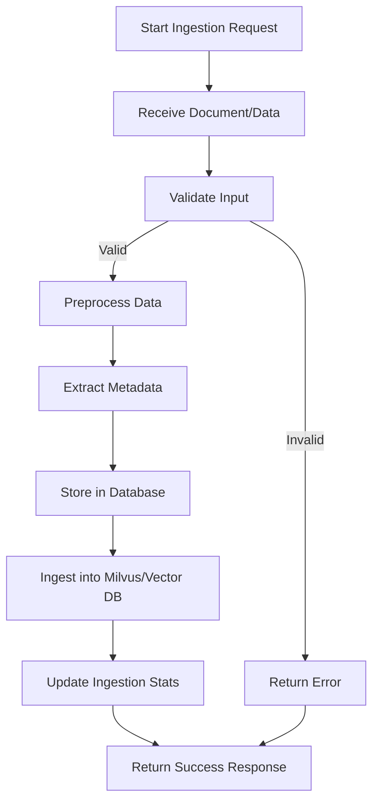

# Ingestion Workflow

This document describes the data ingestion workflow for the Parivesh POC project.

## Overview

The ingestion process handles document and data ingestion into the system, including storage in both the main database and Milvus vector database for RAG capabilities.

## Workflow Diagram



## Process Steps

1. **Start Ingestion Request**: The workflow begins when a document or data ingestion request is initiated.

2. **Receive Document/Data**: The system receives the document or data payload from the client.

3. **Validate Input**: Input validation checks are performed to ensure the data meets required formats and constraints.

4. **Preprocess Data**: Valid data is preprocessed, which may include:
   - Text cleaning and normalization
   - Document chunking for vector storage
   - Format conversion

5. **Extract Metadata**: Metadata is extracted from the document, including:
   - Document type
   - Creation date
   - Source information
   - Custom attributes

6. **Store in Database**: The processed data and metadata are stored in the main database.

7. **Ingest into Milvus/Vector DB**: Document chunks are converted to embeddings and stored in Milvus for semantic search and RAG operations.

8. **Update Ingestion Stats**: Statistics are updated to track ingestion metrics (see `ingestion_stats.json`).

9. **Return Response**: A success or error response is returned to the client.

## Related Files

- `app/ingestion/document_ingestion.py`: Core ingestion logic
- `app/ingestion/advanced_ingestion.py`: Advanced ingestion features
- `app/milvus/milvus_client.py`: Milvus integration
- `ingestion_stats.json`: Ingestion statistics tracking

---

## Database Schema

### Milvus Collection Schema

The system uses Milvus vector database with the following collection schema:

**Collection Name**: `document_embeddings` (default, configurable via `MILVUS_COLLECTION_NAME`)

**Fields**:

| Field Name | Data Type | Description | Constraints |
|------------|-----------|-------------|-------------|
| `id` | INT64 | Unique identifier for each document chunk | Primary Key, Auto-generated |
| `text` | VARCHAR | The actual text content of the chunk | Max length: 65,535 characters |
| `embedding` | FLOAT_VECTOR | Vector embedding of the text | Dimension: 3072 |
| `metadata` | JSON | Rich metadata associated with the chunk | Flexible JSON structure |

**Index Configuration**:
- **Index Type**: IVF_FLAT
- **Metric Type**: L2 (Euclidean Distance)
- **Index Parameters**: `nlist=1024`

### Embedding Configuration

| Parameter | Value | Description |
|-----------|-------|-------------|
| **Model** | `text-embedding-3-large` | OpenAI's large embedding model |
| **Dimension** | 3072 | Vector dimension for embeddings |
| **Chunk Size** | 4000-6000 characters | Size of text chunks for embedding |
| **Chunk Overlap** | 200-400 characters | Overlap between consecutive chunks |

---

## Metadata Fields

The `metadata` JSON field contains rich contextual information for each document chunk:

### Core Metadata Fields

```json
{
  "chunk_index": 0,
  "page_number": 23,
  "section_number": "3.2.1",
  "section_title": "Air Quality Baseline Data",
  "chunk_type": "baseline_data",
  "char_count": 4250,
  "word_count": 680,
  "source": "document"
}
```

### Extended Metadata Fields (Advanced Ingestion)

When using `AdvancedDocumentIngestion`, additional metadata is extracted:

```json
{
  "chunk_index": 5,
  "page_number": 15,
  "section_number": "2.3",
  "section_title": "Project Description",
  "keywords": [
    "carbon black",
    "manufacturing",
    "PCBL",
    "environmental clearance",
    "Tamil Nadu",
    "production capacity"
  ],
  "entities": {
    "locations": ["Tamil Nadu", "Tiruvallur", "Gummidipoondi"],
    "organizations": ["PCBL (TN) Limited", "SIPCOT"],
    "numbers": ["240", "150", "25.5"],
    "dates": ["2024", "Jan 2024"]
  },
  "chunk_type": "section_content",
  "char_count": 3850,
  "word_count": 620,
  "has_tables": false,
  "has_numbers": true
}
```

### Metadata Field Descriptions

| Field | Type | Description |
|-------|------|-------------|
| `chunk_index` | Integer | Sequential index of the chunk in the document |
| `page_number` | Integer | Page number where the chunk appears (0 if unknown) |
| `section_number` | String | Section number (e.g., "3.2.1") extracted from headers |
| `section_title` | String | Title of the section the chunk belongs to |
| `keywords` | Array[String] | Top 15 keywords extracted from the chunk |
| `entities` | Object | Named entities extracted (locations, organizations, numbers, dates) |
| `chunk_type` | String | Type of content: `table`, `section_content`, `executive_summary`, `toc`, `baseline_data`, `impact_assessment`, `compliance`, `general` |
| `char_count` | Integer | Character count of the chunk |
| `word_count` | Integer | Word count of the chunk |
| `has_tables` | Boolean | Whether the chunk contains table data |
| `has_numbers` | Boolean | Whether the chunk contains numerical data |
| `source` | String | Source identifier for the document |

### Keyword Extraction Strategy

Keywords are extracted using multiple strategies:
1. **Capitalized Terms**: Proper nouns and technical terms
2. **Acronyms**: Uppercase abbreviations (e.g., PCBL, SIPCOT)
3. **Technical Terms**: Domain-specific terms with units (TPD, MW, Ha)
4. **Multi-word Phrases**: Important 2-3 word combinations
5. **Frequency Analysis**: Words appearing multiple times with significance
6. **Domain Patterns**: Environmental and regulatory terms

### Entity Recognition

The system extracts the following entity types:
- **Locations**: Villages, districts, taluks, states
- **Organizations**: Company names, regulatory bodies
- **Numbers**: Numerical values with units (capacity, measurements)
- **Dates**: Temporal references in various formats

---

## Configuration Settings

Environment variables used for ingestion:

| Variable | Default Value | Description |
|----------|---------------|-------------|
| `MILVUS_HOST` | `localhost` | Milvus server hostname |
| `MILVUS_PORT` | `19530` | Milvus server port |
| `MILVUS_COLLECTION_NAME` | `document_embeddings` | Name of the Milvus collection |
| `EMBEDDING_DIMENSION` | `3072` | Dimension of embedding vectors |

These settings are defined in `app/core/settings.py` and can be overridden via environment variables.
